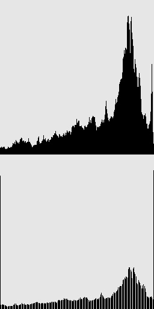
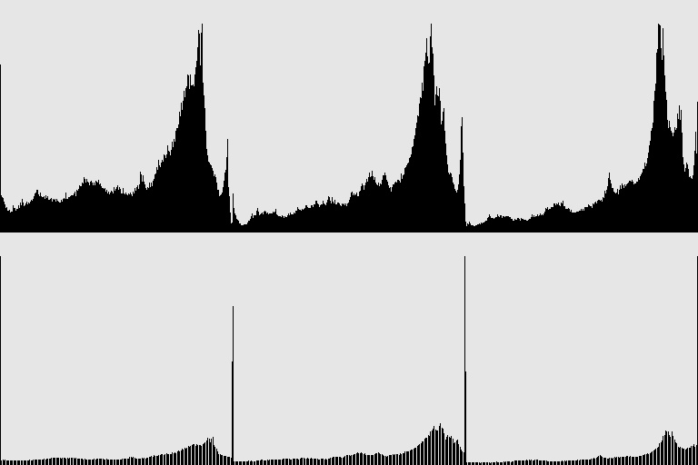

# Лабораторный отчет: Результаты обработки изображений

## Контрастирование одноканального изображения

### Исходное изображение
- Одноканальное изображение, полученное применением фильтра IMREAD_GRAYSCALE к цветному изображению.

### Результат обработки

### Гистограмма контрастированного изображения

## Контрастирование трехканального изображения

### Исходное изображение

### Результат обработки (по отдельным каналам)

### Гистограмма изображения (по отдельным каналам)

### Результат обработки (с общим диапазоном для всех каналов)

### Гистограмма изображения (с общим диапазоном для всех каналов)

---