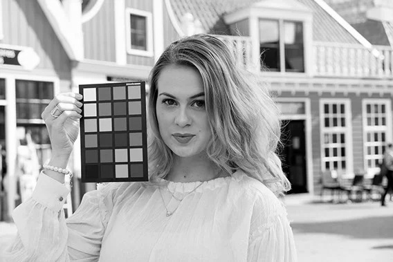
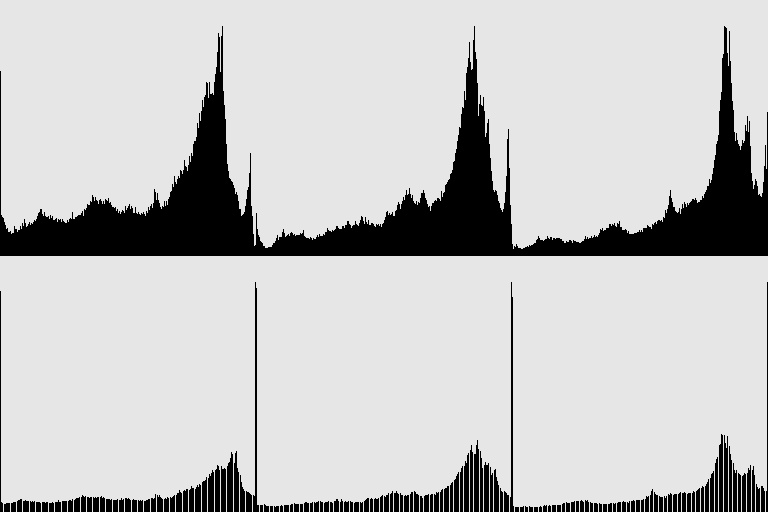

# Отчет о результатах работы кода

## Контрастирование одноканального изображения

### Входное изображение двухканальное изображение(получил открыв цветную с фильтром IMREAD_GRAYSCALE)

### Обработанное изображение

### Гистограмма

## Контрастирование трехканального изображения

### Входное изображение

### Обработанное изображение

### Гистограмма

### Обработанное изображение вторым способом(новый диапозон общий для всех каналов)

### Гистограмма

---