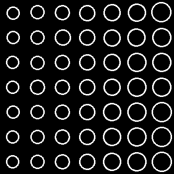

# Лабораторная 4

---

## Полученные детекции изображений методом компонент связности

### 1. Шум 25, радиусы 8-20, минимальный контраст 60

#### Сгенерированные круги


#### Удаление шума с помощью гауссовского блюра
```c++
cv::GaussianBlur(image, no_noise, cv::Size(ksize, ksize), 0); // ksize = 33
```


#### Бинаризация изображения
```c++
adaptiveThreshold(no_noise, binary, 255, cv::ADAPTIVE_THRESH_GAUSSIAN_C, cv::THRESH_BINARY, 33, 0);
```


#### Применение метода компонент связности
```c++
int numLabels = connectedComponentsWithStats(binary, labels, stats, centroids);
```
Из stats выделяем круги детекции с площадью больше 50:


#### Отображение кругов на исходном изображении


#### Расчет и оценка детекций с помощью IOU
Записываем координаты и радиусы каждой детекции, вычисляем IOU с изначальными кругами.

**Результаты:**
- TP = 49
- FP = 0
- FN = 0
- iouThreshold = 0.4

**Точность:**
- TP / (TP + FN + FP) = 1

### 2. Шум 30, радиусы 6-20, минимальный контраст 60


**Результаты:**
- TP = 20
- FP = 5
- FN = 5
- iouThreshold = 0.4

**Точность:**
- TP / (TP + FN + FP) = 0.67

### 3. Шум 20, радиусы 6-14, минимальный контраст 10


**Результаты:**
- TP = 20
- FP = 6
- FN = 5
- iouThreshold = 0.4

**Точность:**
- TP / (TP + FN + FP) = 0.65

### 4. Шум 40, радиусы 10-20, минимальный контраст 70


**Результаты:**
- TP = 21
- FP = 4
- FN = 4
- iouThreshold = 0.4

**Точность:**
- TP / (TP + FN + FP) = 0.72

---

## Результаты в формате JSON

### Input: ground_truth.json
Формат хранения объектов:
```json
{
    "p": [25, 25, 8],
    "c": 107
}
```

### Output: ground_detections.json
Формат хранения детекций:
```json
{
    "p": [174, 25, 15],
    "iou": "0.64"
}
```
`iou` - показатель IOU для каждой детекции