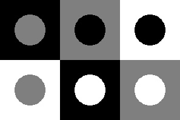
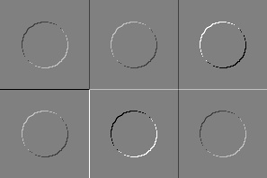
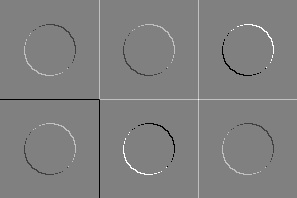
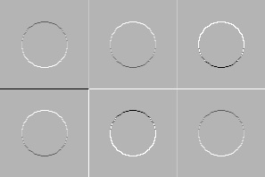
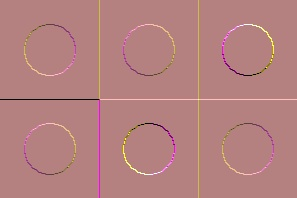

### Лабораторная 5

---

#### 1. Генерация вариантов круга на фоне квадрата

- Размер квадрата: 99x99
- Радиус круга: 25
- Круг в центре квадрата
- Уровни серого: 0, 127, 255
- Квадраты образуют прямоугольник (3 столбца, 2 строки)

Результат:



---

#### 2. Задание ядер для линейной фильтрации

Ядра:

```
+1  0        0 +1
 0 -1    и  -1  0
```

---

#### 3. Линейная фильтрация изображений I1 и I2 с указанными ядрами

- I1: Линейная фильтрация с первым ядром, а также приведение нового диапозона(-255,255) к (0,255)


- I2: Линейная фильтрация со вторым ядром, а также приведение нового диапозона(-255,255) к (0,255)


---

#### 4. Получение изображения I3

```
I3 = sqrt(I1*I1 + I2*I2)
```


---

#### 5. Получение RGB изображения для визуализации

- Канал B: Изображение I1
- Канал G: Изображение I2
- Канал R: Изображение I3


---