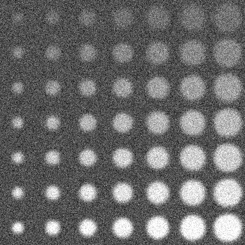
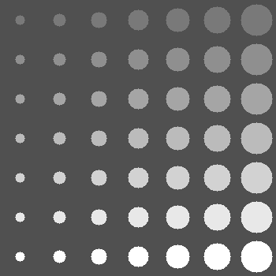
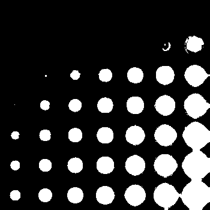
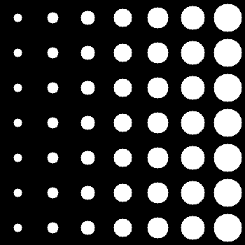
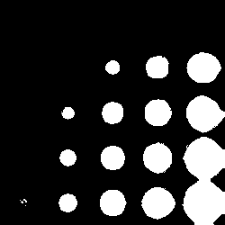
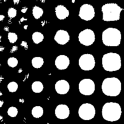
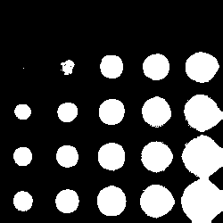
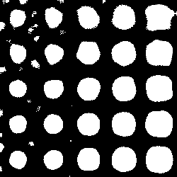
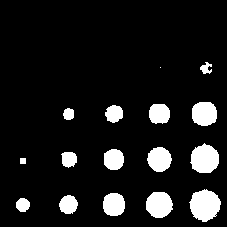
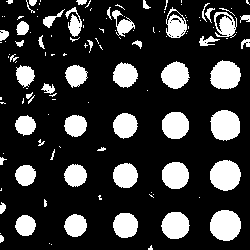

# Отчет по лабораторной работе №7

### Оценка качества сегментации

Для оценки качества сегментации использовался метод, основанный на сравнении пересечения сегментированного изображения с эталонной разметкой. Метрика, применяемая для оценки, - отношение количества совпадающих пикселей к общему количеству пикселей в эталонной разметке (IoU).

## Описание эксперимента

### Данные

Для эксперимента использовались следующие изображения:
- `input.png`: Исходное изображение для сегментации.
- `GT.png`: Эталонная разметка для оценки качества сегментации.

## Результаты

### Заблюренное входное изображение

### Бинаризованное заблюренное изображение

### Применение фильтра MeanShift к заблюренному изображению

### Результат сегментации (бинаризация MeanShift с порогом 100)

### Маска для проведения оценки (бинаризованное изображение ground truth)

### Оценка

Оценка проводилась по среднему значению IoU для каждого круга. Для каждой из 49 точек высчитывалось IoU и затем находилось среднее значение.

#### Результаты
- Сегментация: 0.5
- Бинаризация: 0.64

### Дополнительные примеры работы

#### Пример 1

Результат сегментации:

Результат бинаризации:

Оценка:
- Сегментация: 0.47
- Бинаризация: 0.67

#### Пример 2

Результат сегментации:

Результат бинаризации:

Оценка:
- Сегментация: 0.35
- Бинаризация: 0.29

#### Пример 3

Результат сегментации:

Результат бинаризации:

Оценка:
- Сегментация: 0.32
- Бинаризация: 0.62