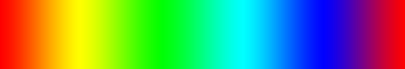
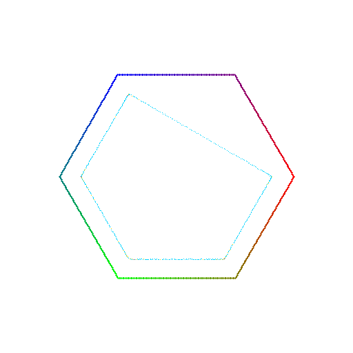
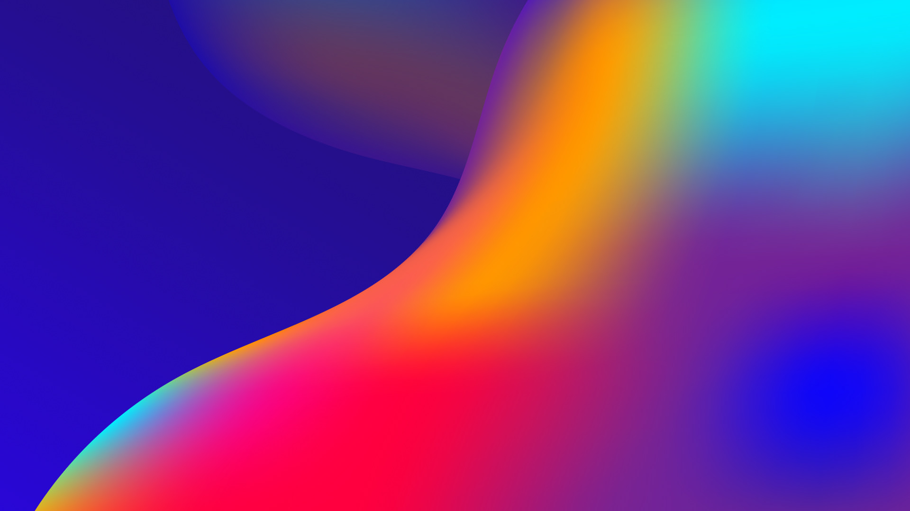
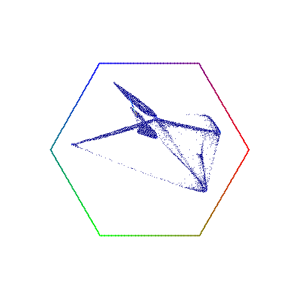
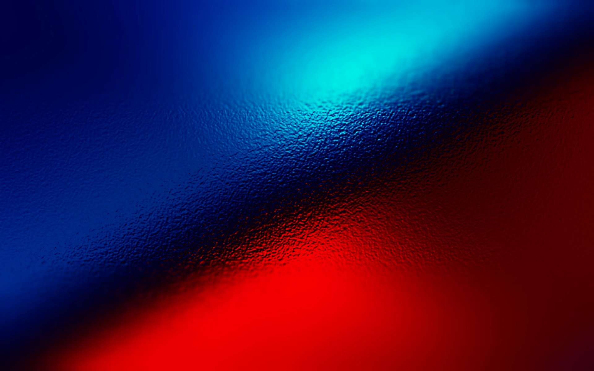
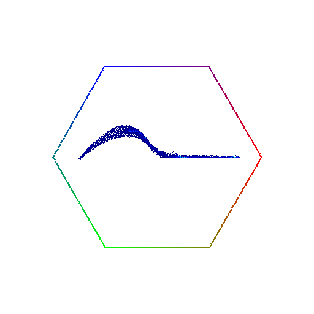
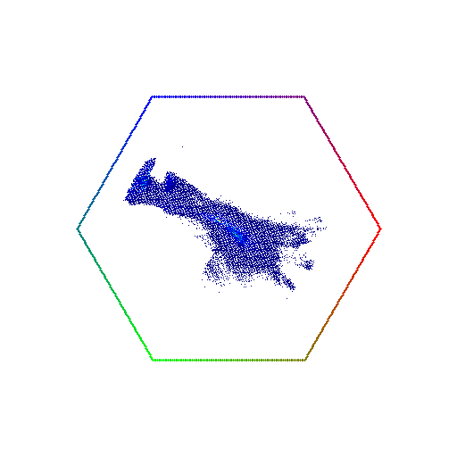

## Входные изображения

Для проекции цветов и визуализации в шестиугольнике использовались следующие изображения:

### Изображение 1

### Выходное изображение 1

### Изображение 2

### Выходное изображение 2

### Изображение 3

### Выходное изображение 3

### Изображение 4

### Выходное изображение 4

## Описание процесса

1. **Проекция и вращение:**
   Пиксельные значения изображений проецируются на двумерную плоскость с использованием заранее заданных матриц проекции и вращения.

2. **Создание шестиугольника:**
   На плоскости рисуется шестиугольник, вершины которого окрашиваются в определенные цвета. Между вершинами создаются плавные градиенты.

3. **Расчет карты плотности:**
   Плотность проецируемых точек рассчитывается путем подсчета количества точек внутри каждого пикселя шестиугольника.

4. **Применение цветовой карты:**
   К карте плотности применяется цветовая карта для визуализации распределения цветов в пределах шестиугольника.

## Заключение

Процесс успешно проецирует цвета изображений на двумерную плоскость и визуализирует их в шестиугольнике с градиентной окраской. Входные изображения и их соответствующие шестиугольные визуализации демонстрируют эффективность метода.