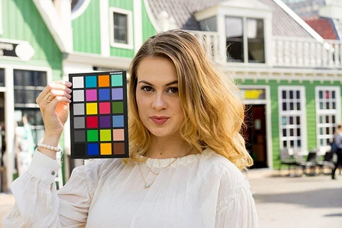
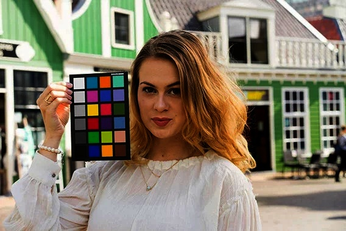
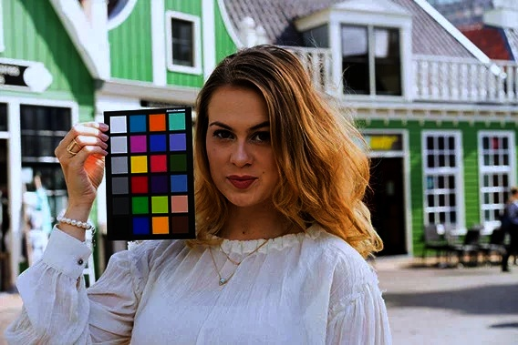
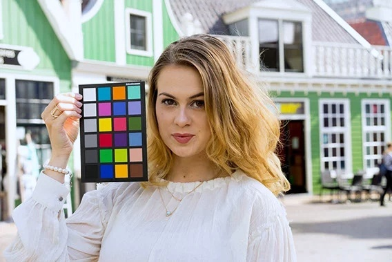

# Отчет по лабораторной работе №9

## Входные изображения

|  1. Входное изображение          | 2. Входное изображение в linRGB  |
|----------------------------------|----------------------------------|
|               |           |

## Обработанные изображения

| 3. linRGB с GRAYWORLD             | 4. GRAYWORLD в sRGB             |
|----------------------------------|----------------------------------|
| |            |

## Контраст

| Контраст по каждому каналу (3lab)                   | Общий контраст для всех каналов (3lab)           |
|-----------------------------------------------------|--------------------------------------------------|
|  |    |

## Сравнение с эталоном

Результаты, полученные на этапе 4, были сравнины с эталонными значениями серых цветов палитры, взятыми из официальной таблицы цветов. Для этого была наложена маска, оставляющая на изображении только цвет ячейки палитры. Также были сравнины результаты из лабораторной работы №3 по тому же принципу.

| Эталонный цвет   | RMSE для GRAYWORLD | RMSE для контраста по каждому каналу | RMSE для общего контраста по каналам |
|------------------|---------------------|--------------------------------------|---------------------------------------|
| [252, 252, 252]  | 15.97               | 12.02                                | 5.58                                 |
| [230, 230, 230]  | 15.95               | 13.70                                | 11.21                                |
| [200, 200, 200]  | 15.92               | 15.05                                | 15.95                                |
| [143, 143, 143]  | 11.84               | 15.44                                | 15.97                                |
| [100, 100, 100]  | 15.97               | 15.97                                | 15.97                                |
| [50, 50, 50]     | 15.97               | 15.97                                | 15.97                                |